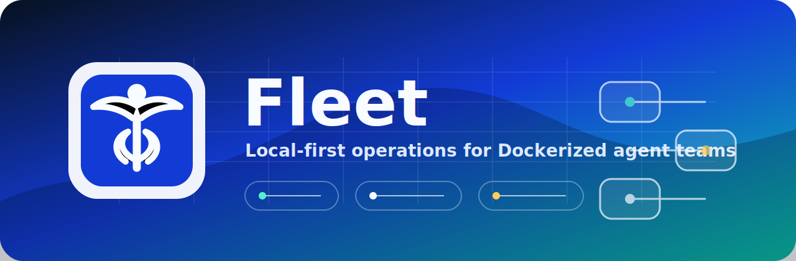
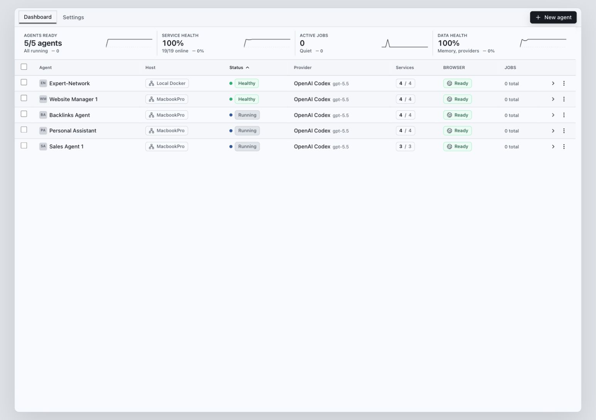
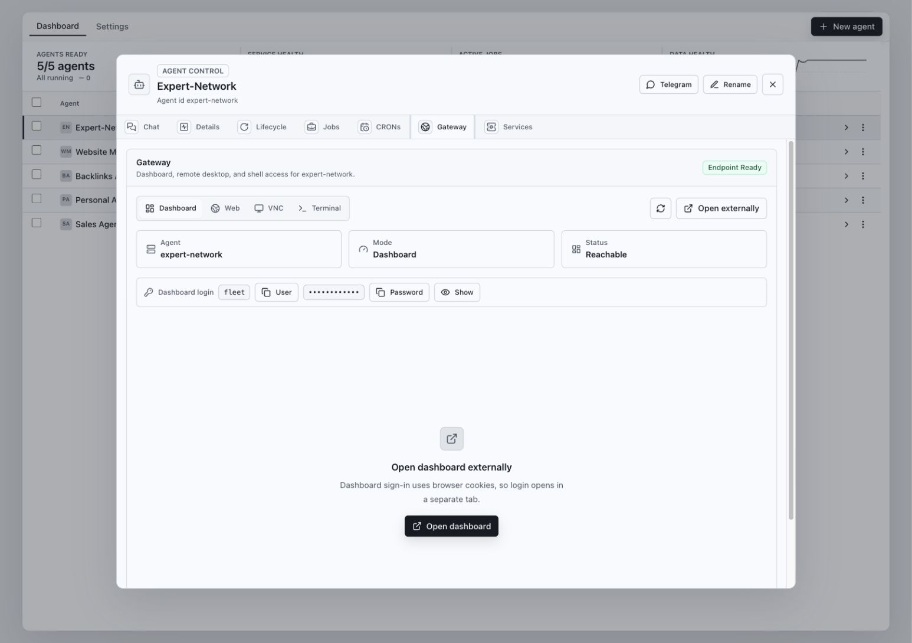

# Fleet

Fleet is a local-first web console for creating, configuring, monitoring, and operating Dockerized Hermes agents across one or more trusted machines.

It is primarily built for Hermes Agent and the NVIDIA-focused Hermes variant, Nemo Hermes. Standard Hermes agents are the default path; Nemo Hermes agents are supported when the `nemohermes` runner is available or automatic installation is enabled.

It gives a single operator view for the parts that become noisy once you run more than one agent: service health, provider defaults, shared credentials, chat sessions, browser sidecars, VNC, terminal access, local web publishing, backups, restores, clones, remote nodes, and setup readiness.

Fleet is designed for technical operators running personal or team-controlled agent infrastructure on a workstation, homelab, VPN, or trusted LAN. Runtime state and secrets stay local by default; the repository keeps source code separate from `.env`, `runtime/`, `data/`, `logs/`, `secrets/`, and `vendor/hermes-agent/`.

## Screenshots





## What Fleet Does

- Creates Hermes Docker agents from a repeatable local baseline.
- Creates Nemo Hermes sandbox agents when the `nemohermes` runner is available or auto-install is enabled.
- Coordinates local agents and trusted remote Fleet nodes from the same dashboard.
- Shows agent state, service counts, health, memory readiness, gateway diagnostics, drift, and update status.
- Opens agent chat, session history, dashboard, VNC, local web preview, and container terminal surfaces.
- Saves fleet-wide provider defaults for OpenAI Codex, Ollama, Custom endpoints, and OpenRouter.
- Stores shared provider credentials in ignored local files and syncs them into selected agents.
- Supports Codex device login and controlled sync of Codex auth state into agents.
- Creates Telegram-enabled agents through the onboarding pairing flow.
- Publishes static files from each agent workspace through a per-agent webhost sidecar.
- Backs up, restores, and clones agents while excluding secrets unless an operator explicitly opts in.
- Runs release and setup audits that keep runtime state, tokens, logs, and oversized source files out of git.

## Requirements

- Node.js 20+ and npm 10+
- Docker with Docker Compose v2
- git, when Fleet should clone the default Hermes source checkout automatically
- Optional: `nemohermes` on `PATH` for Nemo Hermes sandbox agents

The onboarding screen checks these requirements. From a terminal, run the same check with:

```bash
npm run init:baseline
```

## Quickstart

```bash
npm run setup
npm start
```

Open:

```text
http://127.0.0.1:5180
```

`npm run setup` prepares ignored runtime folders, creates `.env` when missing, fixes executable bits on wrapper scripts, installs npm dependencies when needed, clones the configured Hermes source when it is missing, and runs the baseline check.

`npm start` runs the baseline check, builds the frontend, and serves the production app from the Express server.

For active development:

```bash
npm run dev
```

The API runs on `http://127.0.0.1:5180`; the Vite frontend runs on `http://127.0.0.1:5200` and proxies `/api` to the API server.

## First Run

1. Run `npm run setup`.
2. Open `http://127.0.0.1:5180`.
3. Review setup checks on the onboarding screen.
4. Open **Fleet settings** and choose a provider default.
5. Add shared credentials or complete Codex device login if your selected provider needs auth.
6. Create an agent from the dashboard.
7. Open the agent detail view for chat, lifecycle, gateway, terminal, crons, credentials, and diagnostics.

By default, Fleet clones Hermes source into `vendor/hermes-agent` from `HERMES_AGENT_REPO_URL`. To use a checkout somewhere else, set:

```env
HERMES_AGENT_SRC=/path/to/hermes-agent
```

To disable automatic source download:

```env
HERMES_AGENT_AUTO_CLONE=0
```

## Documentation

- [Documentation index](docs/index.md)
- [Getting started](docs/getting-started.md)
- [Operator guide](docs/operator-guide.md)
- [Configuration reference](docs/configuration.md)
- [API reference](docs/api-reference.md)
- [Codebase guide](docs/codebase.md)
- [Implementation patterns](docs/patterns.md)
- [Release checklist](docs/release-checklist.md)
- [Security policy](SECURITY.md)
- [Contributing guide](CONTRIBUTING.md)
- [Support guide](SUPPORT.md)

## Common Commands

```bash
npm run setup          # prepare local runtime state and dependencies
npm start              # build and serve the production console
npm run dev            # run API and Vite dev server
npm run init:baseline  # check local setup readiness
npm run check          # TypeScript type check
npm test               # run node test suite
npm run build          # production frontend build
npm run audit:release  # repository hygiene audit
npm run release:check  # full release gate
npm run knip           # unused-code audit
```

Fleet also includes repo-local wrappers:

```bash
bin/hermes-console
bin/hermes-docker status <agent>
bin/hermes-docker logs <agent>
bin/hermes-docker shell <agent>
bin/hermes-docker restart <agent>
bin/hermes-docker update <agent>
bin/hermes-docker delete <agent>
```

Use the UI for normal operation. Use the wrappers when you need a direct terminal escape hatch for local Docker agents.

## Configuration At A Glance

Fleet reads process env first, then these files when present:

1. `runtime/.env`
2. `.env`
3. `HERMES_CONSOLE_ENV_FILE`
4. `<HERMES_INSTANCES_ROOT>/.env` when `HERMES_INSTANCES_ROOT` is external

The most important local settings are:

```env
HERMES_INSTANCES_ROOT=./runtime
HERMES_DOCKER_BIN=./bin/hermes-docker
HERMES_AGENT_SRC=./vendor/hermes-agent
HERMES_AGENT_AUTO_CLONE=1
HERMES_CAMOFOX_CONTEXT=./docker/camofox
HERMES_WEBHOST_CONTEXT=./docker/webhost
HERMES_CONSOLE_HOST=127.0.0.1
HERMES_CONSOLE_PORT=5180
HERMES_CONSOLE_DATA_DIR=./data
HERMES_CONSOLE_SECRETS_DIR=./secrets
```

Fleet-wide provider defaults and shared credentials are managed from **Fleet settings** and stored in ignored files:

```text
secrets/global-provider.json
secrets/global-credentials.env
secrets/global-oauth/
secrets/global-sync.json
```

Per-agent config lives under each agent folder:

```text
<agent>/
  home/
    .env
    config.yaml
    SOUL.md
  workspace/
    HERMES_WEB.md
    web/
  instance.env
  compose.yaml
```

See [Configuration reference](docs/configuration.md) for the full environment and storage guide.

## Security Defaults

Fleet binds to `127.0.0.1` by default. Before exposing it to a LAN, VPN, reverse proxy, or public network, set:

```env
HERMES_CONSOLE_TOKEN=<long-random-token>
HERMES_CONSOLE_REQUIRE_AUTH=1
```

The server refuses non-loopback binds unless `HERMES_CONSOLE_TOKEN` is set. `npm run setup` prompts for a token when LAN binding or required auth needs one.

Treat Fleet as a control plane. It can start and stop containers, open terminals, sync credentials, restore backups, create agents, proxy remote node actions, and optionally run self-update commands. Keep individual Hermes dashboards, Camofox VNC endpoints, and agent webhosts private unless you intentionally protect and expose them.

## Fleet Nodes

Fleet Nodes let one console coordinate other Fleet consoles on trusted machines. Add remote consoles in **Fleet settings -> Fleet nodes** with a label, base URL, optional bearer token, and enabled state.

The dashboard then merges local and remote agents, shows the host for each row, and routes create, start, stop, restart, update, delete, clone, backup, chat, gateway, terminal, and detail actions through the selected node.

Remote node bearer tokens are redacted in API responses but stored locally in `data/fleet.db`; keep `data/` private and use disk encryption on shared machines.

## Backups, Restore, And Clone

Fleet writes backups to:

```text
data/backups/
```

Backups include agent config, selected workspace files, provider defaults, and a manifest. Secrets such as `home/.env`, global credentials, OAuth state, token-like files, and generated runtime secrets are excluded unless an operator explicitly enables secret export.

Restore uses a local `.tar.gz` archive path on the console host. Restored agents receive fresh generated ports and runtime secrets. Clone duplicates a local agent into a new name and can optionally include workspace files and local per-agent credentials.

## Project Layout

```text
bin/                  fleet wrapper scripts used by the app
docker/camofox/       Camofox sidecar image context
docker/webhost/       Node.js static webhost sidecar image context
server/               Express API, services, SQLite, terminal websocket
src/                  React frontend, UI state, styles, shared models
scripts/              setup, baseline, release audit, dev/start orchestration
docs/                 user, operator, API, and maintainer documentation
runtime/              ignored default Hermes instance root
data/                 ignored SQLite database and local control state
logs/                 ignored local process logs
secrets/              ignored global provider credentials and OAuth state
vendor/hermes-agent/  ignored optional Hermes source checkout/package
```

## Releasing

Before publishing or opening a pull request:

```bash
npm run release:check
git status --short
```

For setup, onboarding, Docker, or environment changes, also run:

```bash
npm run init:baseline -- --json
```

The release gate runs type checking, tests, production build, repository hygiene audit, production dependency audit, and unused-code audit. See [Release checklist](docs/release-checklist.md) for the manual review list.
